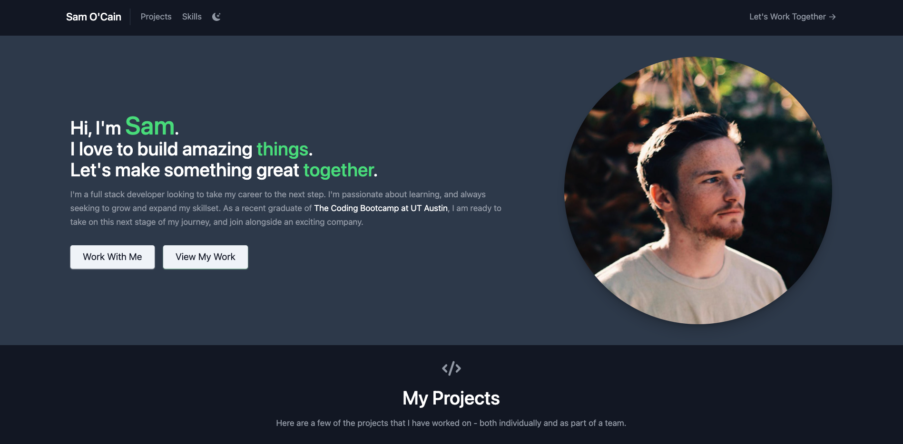
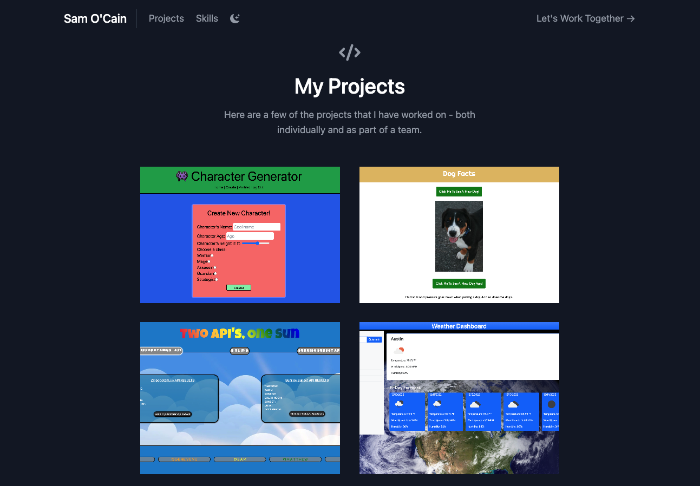
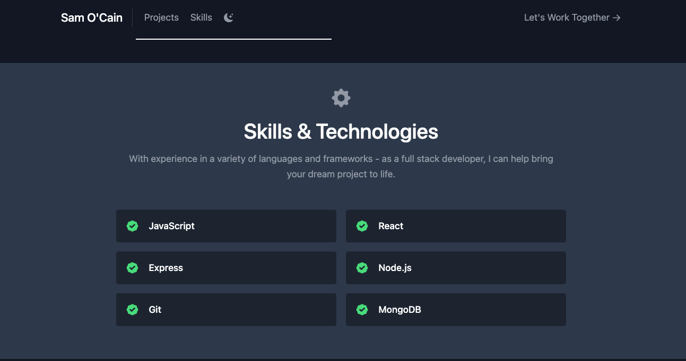
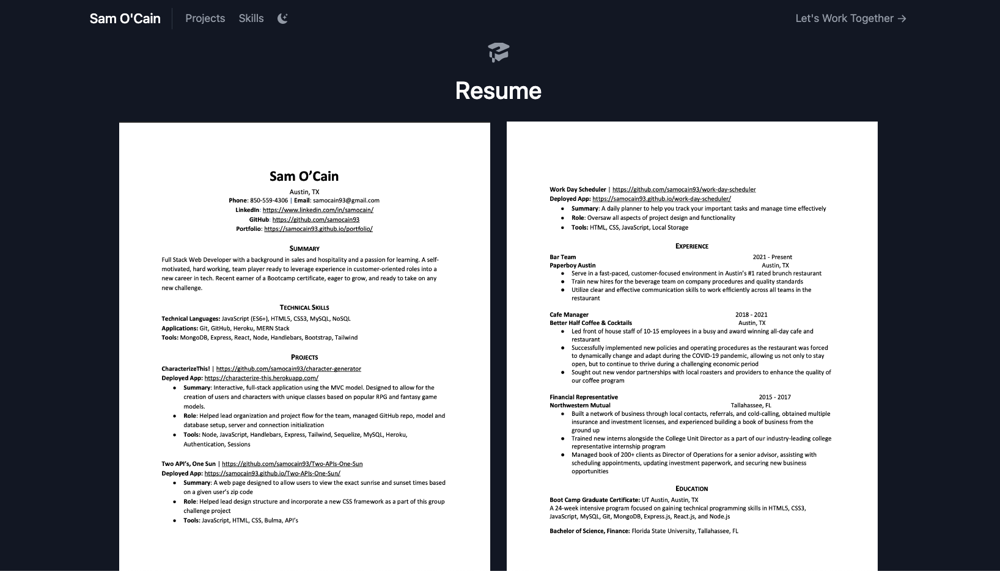
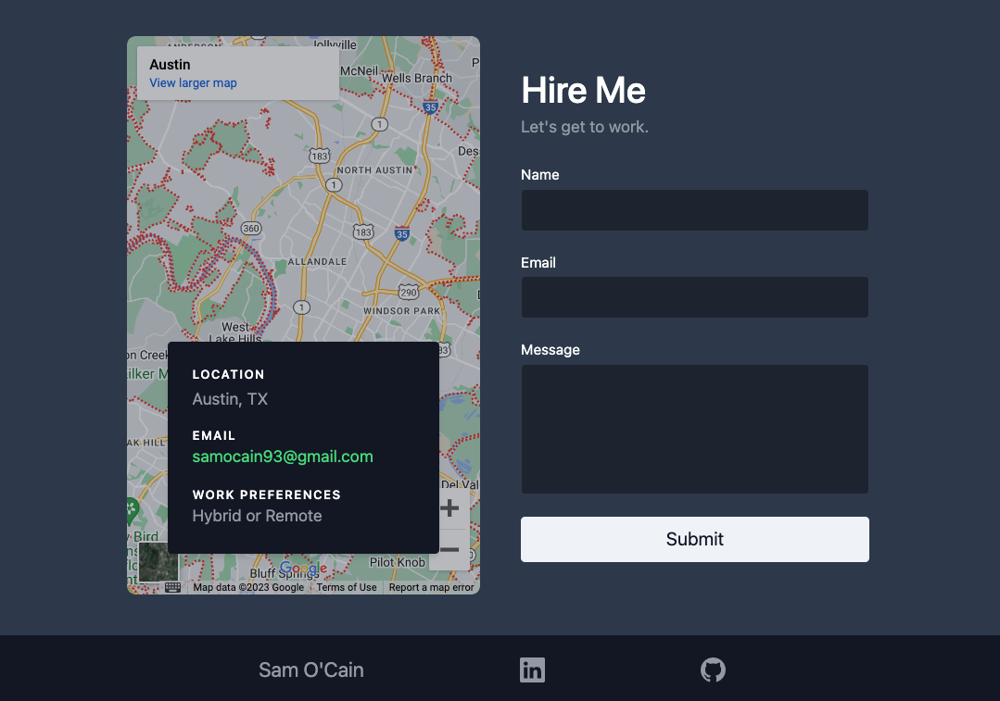

# My Portfolio

A modern, developer portfolio created using React.

## Description

As a developer, it is important to have a thoughtful and well-crafted portfolio website to show off important skills and design ability to potential employers.
This was my first time using React in creating a website, and my goal was to design a simple, yet aesthetic layout that was easy for a user to navigate and gather information about myself, my skills and experience, and easy ways to contact me.

### What I Learned

- Using React for the first time to create a website
- Utilizing Netlify, another provider in order to host my portfolio page
- For my portfolio, I used Vite, and frontend developer tool to build my React project
- Further practice with implementing CSS frameworks such as Tailwind CSS
- Use of a variety of React modules for greater styling, such as React icons

## Table of Contents

- [Built Using](#built-using)
- [Deployed Application](#deployed-application)
- [Features](#features)
- [Usage](#usage)
- [Screenshot](#screenshot)
- [Questions](#questions)
- [Socials](#socials)

## Built Using

      

## Deployed Application

Click Here => { https://samocain.dev/ }

## Features

1. Simple navbar with links to sections of the page and contact form (will be adding a light/dark mode feature as well)
2. Interactive icon elements
3. Project section with image screenshots and overlays of a brief description of each project whereby clicking will take you to the deployed page
4. Simple and clear list of skills and languages
5. Resume section with a clear view of both pages of my resume, as well as a clickable heading title which opens a new window containing a viewable PDF format version of the resume
6. Contact submission form to take questions or messages and send an email to me directly

## Usage

## Questions

Email: [samocain93@gmail.com](mailto:samocain93@gmail.com)

GitHub: [samocain93](https://github.com/samocain93)

## Socials

